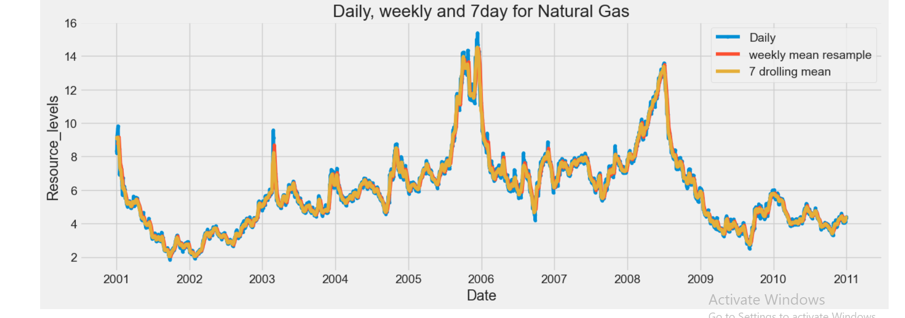
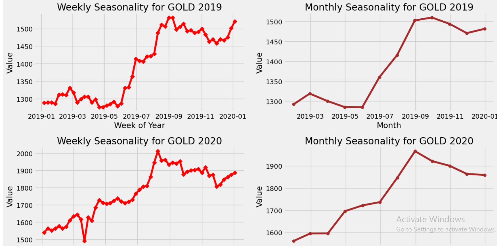
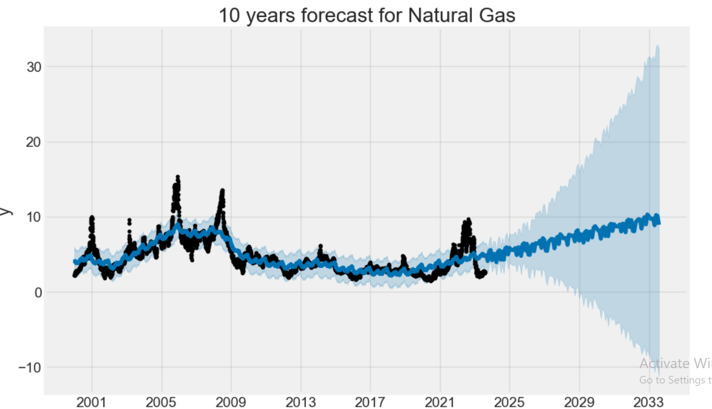
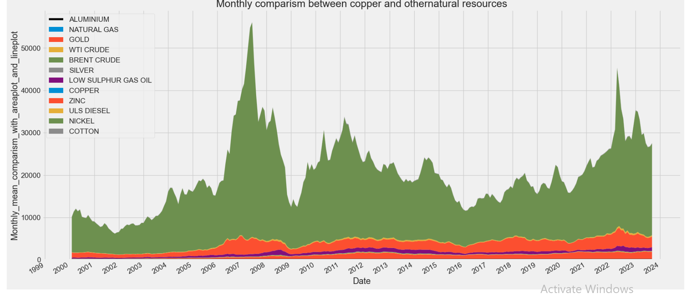
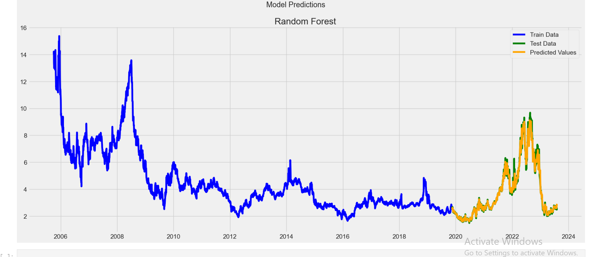

**Natural Resources Price Trend Analysis**

Python driven time series analysis of natural resource prices (2000–2023), including seasonality detection, visualization, and forecasting..
________________________________________
**Overview**

This project examines how major natural resource prices have changed over a 23 year period, using Python and time series methods to uncover long term trends, seasonal patterns, and future price behavior through forecasting models..
________________________________________
**Tools Used**

•	Python
•	Pandas
•	NumPy
•	Matplotlib
•	Plotly
•	Prophet
•	Jupyter Notebook
________________________________________
**Dataset**

•	Long term dataset — The data tracks natural resource prices across more than two decades.
•	2000–2023 window — The study spans the full period from 2000 to 2023.Daily observations
•	Daily observations — Each commodity is recorded daily, allowing for detailed trend and seasonality analysis.
•	Wide range of commodities — The dataset includes energy, metals, agriculture, and livestock categories.

________________________________________
**Objectives**

•	Analyze long term trends — Examine how natural resource prices have evolved over time.
•	Study seasonality — Identify weekly, monthly, and yearly seasonal patterns.
•	Visualize price movements — Create visualizations at daily, weekly, and monthly levels.
•	Apply rolling averages — Use 7 , 30 , and 365 day rolling averages to reveal short , medium , and long term trends.
•	Build predictive models — Develop forecasting models to understand future price behavior.
•	Produce three year forecasts — Generate forward looking forecasts for selected natural resources.
________________________________________
## Representative Visualizations

### Price Trends

---

### Rolling Mean Analysis

---

### Seasonality Analysis

---

### Forecasting

---

### Resampling

---

### Supervised Machine Learning Algorithm

________________________________________
**Key Findings**

•	Significant volatility — Commodity prices experienced notable fluctuations throughout the study period.
•	Distinct resource patterns — Different resources displayed their own long term trends and seasonal cycles.
•	Rolling average insights — Rolling averages helped reveal underlying long term movements that were less visible in the raw data.
•	Forecasting signals
________________________________________
**Repository Structure**

Natural-Resources-Price-Trend-Analysis
│
├── screenshots
├── documentation
├── notebooks
├── html
└── README.md
________________________________________
**Documentation**

Detailed project documentation is available in the documentation folder.
________________________________________
**Disclaimer**

This project was developed for educational and portfolio purposes and uses publicly available data.

